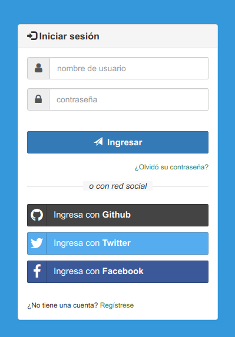
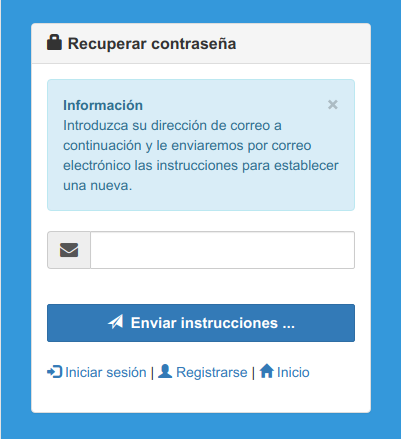
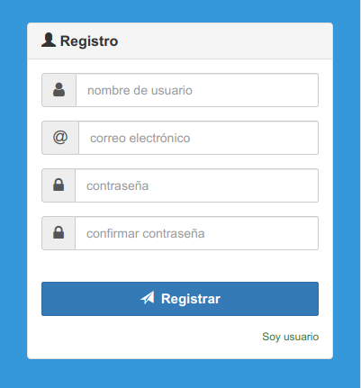

# django-auth

aplicación para la autenticación mediante django o por redes sociales


### create a new repository on the command line
```
git init
git add README.md
git commit -m "first commit"
git remote add origin https://github.com/robertowest/django-auth.git
git push -u origin master


### push an existing repository from the command line
git remote add origin https://github.com/robertowest/django-auth.git
git push -u origin master
```







